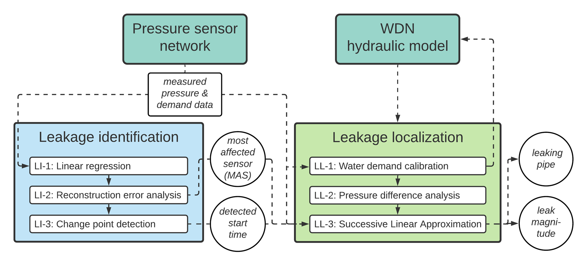

#运行方式
环境准备

安装依赖：

请参考 dependencies.md 文件，下载并安装其中列出的第三方库及其指定版本。
确保使用与 dependencies.md 中指定的版本一致的库，以避免兼容性问题。
推荐使用 pip 或 conda 安装依赖，例如：pip install -r dependencies.md

或根据 dependencies.md 中的说明逐一安装。


安装 Jupyter Notebook：

如果尚未安装 Jupyter Notebook，可通过以下命令安装：pip install jupyter


#运行步骤

启动 Jupyter Notebook：

在终端或命令行中，进入项目目录，运行：jupyter notebook


这将在浏览器中打开 Jupyter Notebook 界面。


打开并运行 Notebook：

在 Jupyter Notebook 界面中，找到项目中的 .ipynb 文件。
逐个打开每个 Notebook 文件。
按顺序运行每个代码单元（Cell），可通过点击“Run”按钮或按 Shift + Enter 执行。
确保按照代码的逻辑顺序运行，以避免依赖错误。


注意事项

依赖版本：请严格按照 dependencies.md 中指定的版本安装库，版本不匹配可能导致运行错误。
运行环境：建议使用 Python 虚拟环境（如 venv 或 conda）以隔离项目依赖。
错误排查：如果运行过程中出现错误，请检查：
第三方库是否正确安装。
Jupyter Notebook 是否正常启动。
代码单元是否按顺序执行。


# LILA - the sequential pressure-based algorithm for data-driven Leakage Identification and model-based Localization
This repository contains the Leakage Identification part of **LILA - the sequential pressure-based algorithm for data-driven Leakage Identification
and model-based Localization in water distribution networks**. LILA identifies potential leakages via semisupervised linear regression of pairwise sensor pressure data and provides the location of theis nearest sensor. LILA also locates leaky pipes relying on an initial set of candidate pipes and a simulation-based optimization framework with iterative linear and mixed-integer linear programming.

### Citation
If you use LILA or part of its code, please consider citing [our paper](https://ascelibrary.org/doi/epdf/10.1061/%28ASCE%29WR.1943-5452.0001535) that describes it:
```
Daniel, I., Pesantez, J., Letzgus, S., Khaksar Fasaee, M.A., Alghamdi, F., Berglund, E., Mahinthakumar, G. 
and Cominola, A., 2022. A Sequential Pressure-Based Algorithm for Data-Driven Leakage Identification and 
Model-Based Localization in Water Distribution Networks. Journal of Water Resources Planning and Management, 
148(6), p.04022025. DOI:10.1061/(ASCE)WR.1943-5452.0001535
```
### Authors
- [Ivo Daniel](https://www.swn.tu-berlin.de/menue/team/msc_ivo_daniel/), [Andrea Cominola](https://www.swn.tu-berlin.de/menue/team/prof_dr_andrea_cominola/) - [Chair of Smart Water Networks](https://swn.tu-berlin.de) | [Technische Universität Berlin](https://tu.berlin) and [Einstein Center Digital Future, Berlin](https://digital-future.berlin) (Germany)
- Simon Letzgus - [Machine Learning group](https://www.ml.tu-berlin.de/menue/machine_learning/) | [Technische Universität Berlin](https://tu.berlin) (Germany)

The above authors contributed to the content of this repository. For the full team of authors of LILA, refer to the authors of the above-cited paper.

### Awards
An early version of LILA was awarded the **Third Place Award** for outstanding achievement in the [BattLeDIM 2020](https://battledim.ucy.ac.cy), the Battle of the Leakage Detection and Isolation Methods. Check out this presentation by our Leakbusers team here: https://www.youtube.com/watch?v=PrHgNnQn-lQ

## Getting started with LILA
LILA operates in a sequential way, represented in this flowchart:

*source: underlying work (Daniel et al., 2022)*

### Leakage Identification module
The [```2019_leakage_identification.ipynb```](LI/2019_leakage_identification.ipynb) notebook in folder [LI](LI/) performs the **leakage identification** task, which is designed to raise an alarm about the presence of a potential leak. Firstly, the water distribution network and the time series of pressure at network nodes provided as input are analyzed as a whole to visualize all occurring leakages simultaneously. Thereafter, each identified leak is investigated individually to estimate a precise leak start time.
In general, the leakage identification module performs two sequential steps:
1. **Linear regression analysis** is performed on pairs of time series from pressure data and the residual error of the model is calculated.
2. **Change point detection** is applied to the residual from the pairwise linear regression analysis to provide the starting times of the leaks.

The final section of the [notebook](LI/2019_leakage_identification.ipynb) also provides the code used to generate the following figures in [Daniel et al. (2022)](DOI:10.1061/(ASCE)WR.1943-5452.0001535):
- Fig. 3: sensitivity analysis
- Fig. 4: comparison of residual error vs. ground truth
- Fig. 5: exemplary residual error trajectories during leakages with annotations
- Fig. 6: result summary for leakage time-to-detection and total lost water volume
- Fig. 7: result summary for leakage detection distance
- Fig. 9: study of leak-to-noise ratio and cusum hyperparameters
- Fig. 10: time series of residual error for individual leaks used for change point detection

### Leakage Localization module
Part of the code to run the Leakage localization module of LILA is availablle in this repository:
https://github.com/jorgeps86/LeakLocalization

### Dependencies
Dependencies and package version are listed in [```dependencies.md```](https://github.com/SWN-group-at-TU-Berlin/LILA/blob/main/dependencies.md)

## Dataset
The work in this repository is applied to the dataset of the [BattLeDIM 2020](https://battledim.ucy.ac.cy/), the Battle of the Leakage Detection and Isolation Methods. The BattLeDIM dataset is open and available at the links below.
Information on the BattLeDIM can be found at the following links:
- Official website of the BattLeDIM, hosted by the BattLeDIM committee:  https://battledim.ucy.ac.cy/
- BattLeDIM problem description and rules: https://zenodo.org/record/3902046
- BattLeDIM dataset: https://zenodo.org/record/4017659#.X4mBaC2w1hE
- BattLeDIM results: https://zenodo.org/record/4139603#.X8lAfbG5p04.mendeley

## References
LILA is fully presented and tested in [Daniel et al. (2022)](DOI:10.1061/(ASCE)WR.1943-5452.0001535):
```
Daniel, I., Pesantez, J., Letzgus, S., Khaksar Fasaee, M.A., Alghamdi, F., Berglund, E., Mahinthakumar, G. 
and Cominola, A., 2022. A Sequential Pressure-Based Algorithm for Data-Driven Leakage Identification and 
Model-Based Localization in Water Distribution Networks. Journal of Water Resources Planning and Management, 
148(6), p.04022025. DOI:10.1061/(ASCE)WR.1943-5452.0001535
```
LILA derives from an initial version of the algorithm presented in [Daniel et al. (2020)](https://doi.org/10.5281/zenodo.3924632) and used during the BattLeDIM competition: [](https://doi.org/10.5281/zenodo.3924632)
```
Daniel, Ivo, Pesantez, Jorge, Letzgus, Simon, Khaksar Fasaee, Mohammad Ali, Alghamdi, Faisal, Mahinthajkumar, Kumar,
Berglund, Emily, & Cominola, Andrea. (2020). A high-resolution pressure-driven method for leakage identification and
localization in water distribution networks. Zenodo. https://doi.org/10.5281/zenodo.3924632
```

### LICENSE
Copyright (C) 2021 Ivo Daniel, Simon Letzgus, Andrea Cominola. Released under the [GNU General Public License v3.0](LICENSE). The code is distributed in the hope that it will be useful, but WITHOUT ANY WARRANTY; without even the implied warranty of MERCHANTABILITY or FITNESS FOR A PARTICULAR PURPOSE. See the GNU General Public License for more details: http://www.gnu.org/licenses/licenses.en.html.
